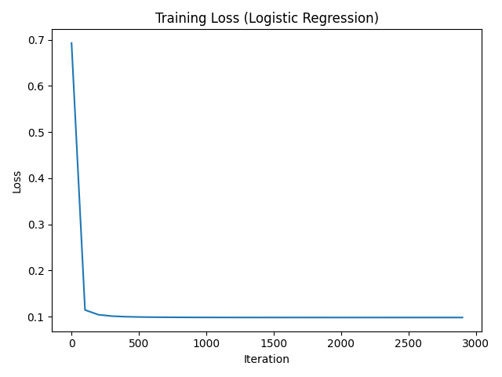

# Logistic Regression (L2, From Scratch)

Binary logistic regression implemented from scratch using gradient descent with L2 regularization (applied to weights, not the bias). Includes a stratified train/val/test split, feature standardization using training statistics only, a numerically stable sigmoid, and evaluation metrics.

## Model
- Sigmoid: σ(z) = 1 / (1 + e^(−z))
- Prediction: p̂ = σ(θᵀx̄), where x̄ includes a bias term
- Binary cross-entropy:
  L(θ) = −(1/n) Σ [ yᵢ log(p̂ᵢ) + (1 − yᵢ) log(1 − p̂ᵢ) ]
- Regularized objective (L2 on weights, not bias):
  J(θ) = L(θ) + (λ/2) ||w||²
- Gradient:
  ∇θJ = (1/n) X̄ᵀ(p̂ − y) + λ[0, w]ᵀ

## Data Pipeline
- Stratified split: 60/20/20
- Standardize using training mean/std only; apply to val/test
- Add intercept column of ones

## Training
Gradient descent uses:
- learning rate α = 0.1
- iterations = 3000
- λ = 0.01

## Loss Curve


## Evaluation
Reports:
- Accuracy, Precision, Recall, F1
- Confusion counts (TP, TN, FP, FN)
- First 5 test predictions (probability, predicted class, true label)

## How to Run
1. Install dependencies:
   ```bash
   pip install -r requirements.txt
2. Run:
   ```bash
   python train.py